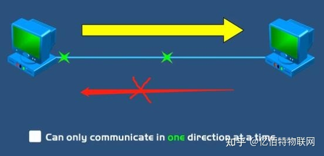
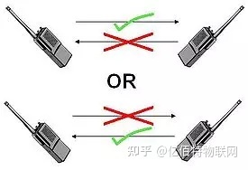

# 概论

## 1.数据通信

### 五个组件  

1. 报文（message）
2. 发送方（sender）
3. 接收方（receiver/destination）
4. 传输介质（transmission medium）
5. 协议（protocol）

### 常见数据类型及其格式

|数据名称|格式|
---|---
文本|编码 Unicode ASCII GB
图像|JPG RGB YCM
音频|MP3 APE
视频|MPG RMVB MP4

### 数据流工作模式

1. 单工（simplex）
     

2. 半双工（half-duplex）  
   

3. 全双工（full-duplex）  

## 网络

### 1.定义：节点（node）与链路（link）的集合

### 2.分布式处理

将任务划分给多台计算机的处理方式，是现在通信系统中流行的处理方式。

### 3.网络准则

#### 3.1.性能标准

吞吐量（throughput）：

延迟 （delay），latency：

#### 3.2 可靠性标准

故障发生频率

故障恢复花费时间

健壮性

#### 3.3安全标准

传输途中不受攻击

丢失损伤恢复策略和方法

### 4.拓扑结构分类

### 4.1 全连接网状结构

##### 优点：

1.消除了共享通信量的问题

2.健壮 安全 机密

3.易于故障识别和隔离

##### 缺点：

1.安装困难，线缆总数多

2.费用高

#### 4.2星型拓扑

##### 优点：

1.易于安装和配置

2.健壮性

3.易于故障识别和隔离

4.价格便宜

##### 缺点：

1.依赖集线器

2.线缆多

#### 4.3总线拓扑

##### 优点：

易于安装，线缆数量少

##### 缺点：

1.重新连接和错误隔离困难

2.一处错误整个总线都受影响

#### 4.4 环状拓扑

##### 优点：

1.易于安装与重新配置

2.易于故障识别和隔离

##### 缺点：

单个节点错误会导致整个网络瘫痪

## 网络模型

### 1.OSI七层模型

#### 物理层：物理层包含在物理介质上传输位流所需的功能，定义了接口与传输介质的机械和电气特性。

#### 数据链路层：将物理层的数据无差错的传递给网络层==检错纠错能力==

#### 网络层：将各个分组从源地址传递到目的地址

#### 传输层：一个报文从一个进程到另一个进程的传递

#### 会话层：对话控制与同步

#### 表示层：翻译加密和压缩数据

#### 应用层：向用户提供服务

## TCP/IP协议族

